# AI Usage

<table>
  <tr>
    <td align="center" width="25%">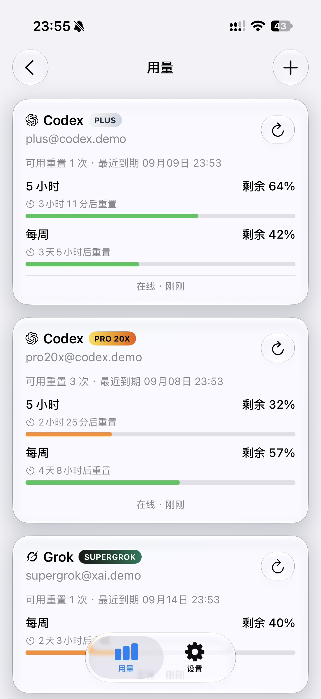</td>
    <td align="center" width="25%">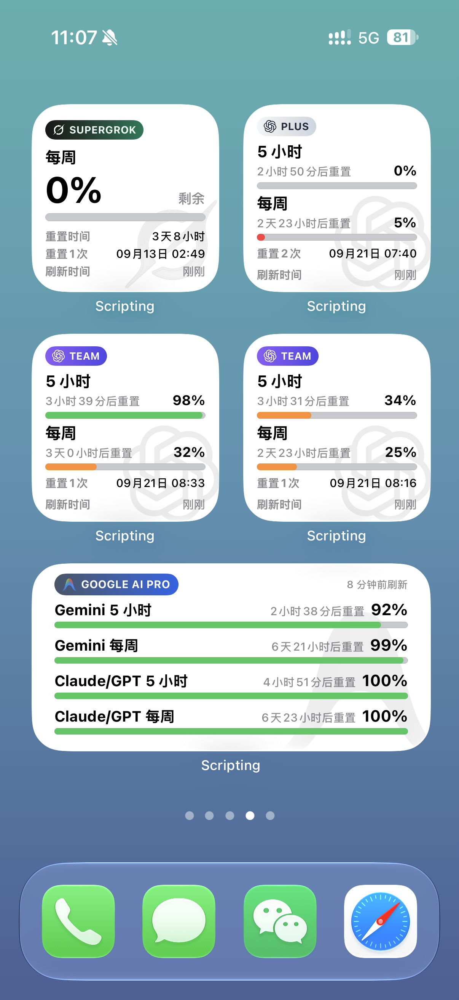</td>
    <td align="center" width="25%">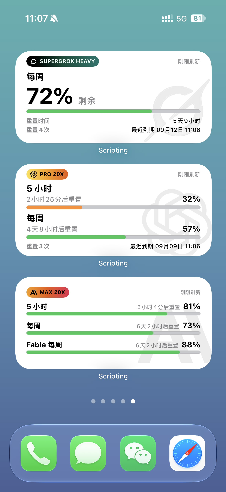</td>
    <td align="center" width="25%">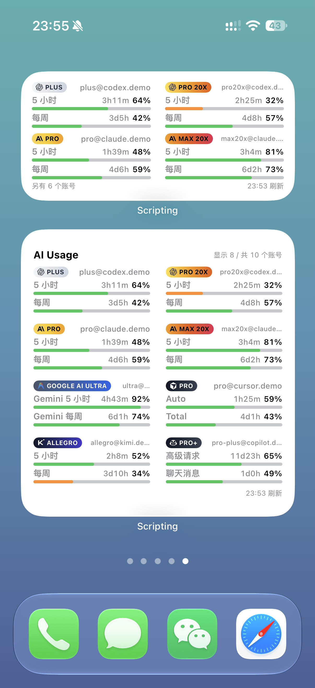</td>
  </tr>
  <tr>
    <td align="center" width="25%">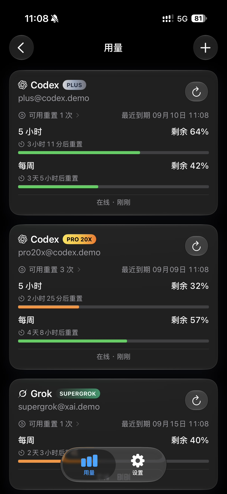</td>
    <td align="center" width="25%">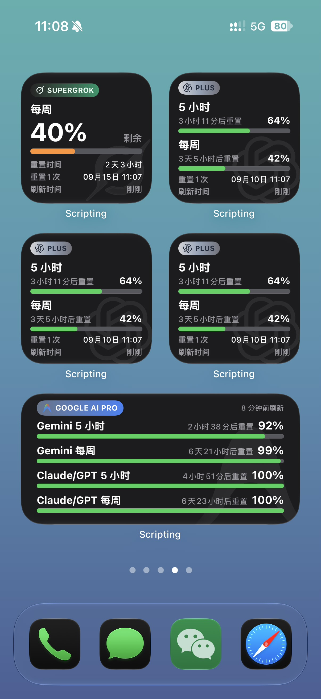</td>
    <td align="center" width="25%">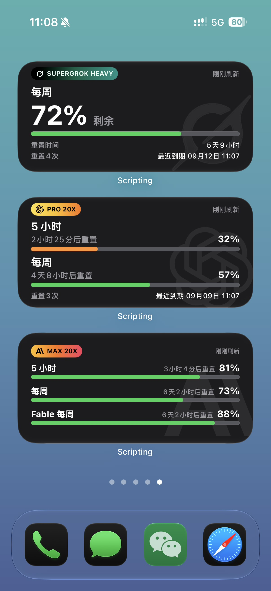</td>
    <td align="center" width="25%">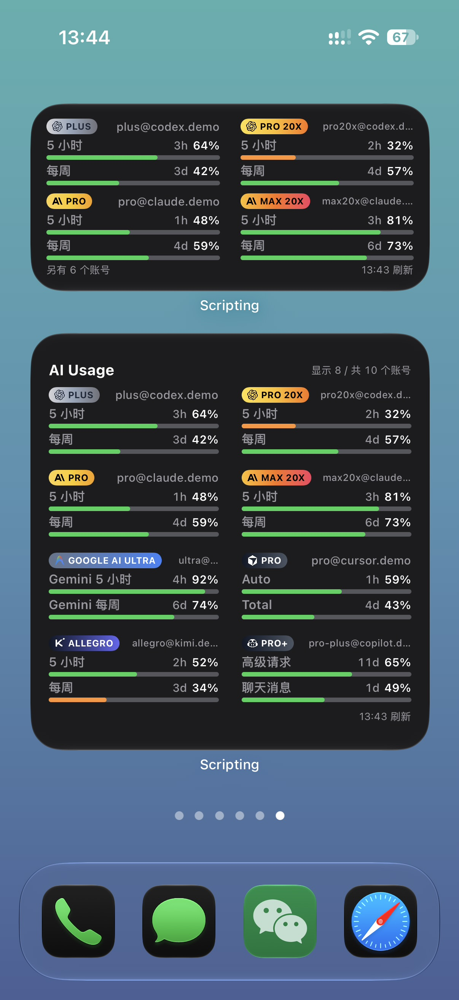</td>
  </tr>
  <tr>
    <td align="center" width="25%">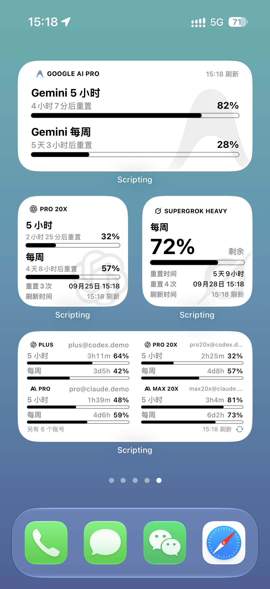</td>
    <td align="center" width="25%">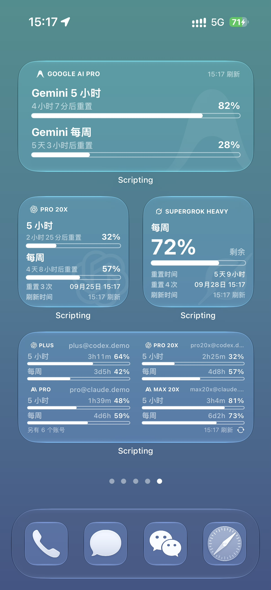</td>
    <td align="center" width="25%">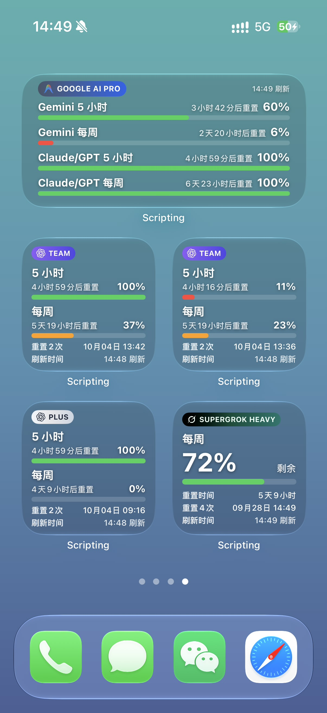</td>
    <td align="center" width="25%">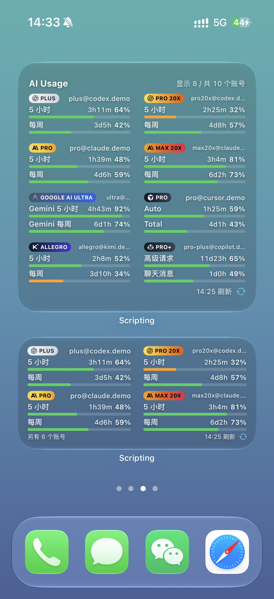</td>
  </tr>
</table>

面向 [Scripting App](https://scriptingapp.github.io/) 的非官方多平台用量查看应用。在一个项目里管理 Codex、Grok、Claude、Antigravity、Cursor、Kimi Code、GitHub Copilot、Z.ai 与 MiniMax 的多账号用量、主屏幕小组件和自动化刷新。

当前版本：`1.7.1`

> 本项目不是 OpenAI、xAI、Anthropic、Google 或 Scripting App 官方产品，与上述平台无隶属或合作关系。

## 功能

- **多平台用量集中聚合**：统一连接并追踪 Codex、Grok、Claude、Antigravity、Cursor、Kimi Code、GitHub Copilot、Z.ai 与 MiniMax 多平台账号，支持同平台多账号并行管理与多窗口额度独立跟踪。
- **全尺寸主屏幕小组件**：
  - 覆盖单账号（Small / Medium）与多账号聚合看板（Small / Medium / Large / ExtraLarge），支持集中配置展示账号、额度窗口与账号标识。
  - **默认彩色风格**：保留经典彩色品牌胶囊徽章，配备绿 / 橙 / 红三段式用量风险预警进度条（剩余 ≤40% 预警，≤15% 紧急），主数值固定显示剩余额度。
  - **Clear 简约风格**：内置独立外观开关。在普通桌面上呈现黑白反差的高级线框极简风；在透明桌面上呈现纯粹通透的白线框极简风。
  - **透明小组件深度适配**：解绑系统固定背景，采用 15% 黄金微透暗底托底，配合全天候通透纯白高亮字、苹果亮绿用量色与抗杂色文字微阴影（*受限于无实时模糊的系统切图机制，不保证在所有高反差、强光或复杂壁纸下视觉效果均佳*）。
- **文件级加密备份与恢复**：采用 PBKDF2-HMAC-SHA256 密钥派生与 AES-256-GCM 强加密算法，安全导出与跨设备迁移 Keychain 凭据、默认平台选择与小组件布局偏好；支持原地增量合并与过期残留字段清理。
- **平滑离线缓存回退**：遭遇网络波动、服务宕机或官方接口限流时，小组件与应用内自动平滑回退至最近一次成功缓存，避免白屏与报错跳动。
- **开箱只读演示模式**：内置完整 Demo 数据集，无需绑定真实密钥即可直接在应用内与主屏幕小组件上预览全部尺寸与布局效果。
- **硬件级本地隐私安全**：所有 Access Token、Refresh Token 与身份凭据直接保存于 iOS 本机 Keychain 硬件保护区，用量查询直连官方服务，零第三方中转，日志绝不记录敏感凭据。

## 系统要求

- iPhone 或 iPad
- 已安装 Scripting App
- 具备对应平台用量查询资格的账号
- 需要联网完成 OAuth 和用量查询
- 不需要 Scripting Pro

## 安装

1. 下载本项目目录或发布的 `AI-Usage.scripting` 安装包。
2. 将 `AI Usage` 导入 Scripting App。
3. 在 Scripting 中运行 `AI Usage`，进入用量页。
4. 按下方步骤完成对应平台的 OAuth。
5. 在主屏幕添加 Scripting 小组件，并选择 `AI Usage`。

远程导入地址：

```text
https://raw.githubusercontent.com/StarYunLee/Scripting/main/AI-Usage.scripting
```

## OAuth 登录

在用量页点击右上角 `+` 并选择平台。应用会根据平台引导完成授权：回调地址、一次性授权码、API Key 或 Subscription Key 粘贴后会自动验证并连接；Cursor、Kimi Code 与 GitHub Copilot 会在关闭授权页后自动检查结果。

### Codex

- 回调：`http://localhost:1455/auth/callback?...`
- 复制 Safari 地址栏中的完整回调地址

### Grok

- 回调：`http://127.0.0.1:56122/callback?...`
- 可复制完整回调地址，或页面显示的一次性代码

### Claude

- 回调页会显示一次性授权码，通常形如 `code#state`
- 复制整段授权码

### Antigravity

- 回调：`http://localhost:51121/oauth-callback?...`
- 复制 Safari 地址栏中的完整回调地址

### Cursor

- 在应用打开的授权页中完成登录
- 关闭授权页后应用会自动检查并完成连接，无需填写回调内容

### Kimi Code

- 使用授权链接在浏览器完成设备授权
- 关闭授权页后应用会自动检查并完成连接

### GitHub Copilot

- 先复制应用显示的设备码，再打开 GitHub 授权页完成设备授权
- 关闭授权页后应用会持续检查，并在成功后自动连接

### Z.ai

- 先选择国际站 Z.ai 或国内站智谱开放平台
- 从对应控制台复制 API Key，粘贴后自动验证；密钥错误时可以原地重新粘贴

### MiniMax

- 先选择国际站 `minimax.io` 或国内站 `minimaxi.com`
- 从对应站点复制 Subscription Key，粘贴后自动验证；密钥错误时可以原地重新粘贴

回调型 OAuth 临时状态有效期为 10 分钟，设备授权与控制台密钥验证通常为 15 分钟。Authorization Code 通常只能交换一次；授权失败或超时后请按页面提示继续或重新开始。

> 回调 URL 和一次性授权码属于短期敏感凭据。不要截图、公开或发送给他人。

## 多账号与小组件参数

- 每个账号拥有独立的 Keychain 凭证和用量缓存
- 可以同时添加同一平台或多个平台的账号
- 小组件参数为空时，若只有一个已授权账号，会自动选择该账号
- 多账号时请填写对应参数，每个主屏幕小组件可以绑定不同账号
- 布局按账号独立保存；刷新频率对所有账号生效

绑定账号的方法：

1. 打开目标账号详情页，点击“复制组件参数”
2. 长按主屏幕小组件，选择“编辑小组件”
3. 将参数粘贴到“参数”

参数格式：

```text
provider:profileId
```

多账号小组件使用固定参数：

```text
dashboard
```

在设置页的“多账号小组件”中可以控制账号标识、进入账号配置、选择每个账号的额度窗口并预览不同尺寸。

## 应用内用量总览

- 设置页可以集中控制每个已连接账号是否显示在应用的“用量”页面
- 账号详情页可以独立选择该账号要显示的额度窗口，并至少保留一个窗口
- 这些设置只影响应用内用量总览，不影响普通单账号主屏幕小组件、授权或刷新

## 小组件显示

小组件不再提供“已用 / 剩余”切换。主数值和进度条长度都固定为剩余额度；颜色仍按已用比例判断风险。刷新时间和重置时间使用相对表述。

- 绿色：剩余高于 40%
- 橙色：剩余不高于 40%、高于 15%
- 红色：剩余不高于 15%

### Small

- 按账号所选窗口自适应：1 个窗口显示单额度详情，2 个窗口上下排列
- 单额度详情同时列出已用和剩余百分比，主数字与进度条仍表示剩余
- 超过 2 项时只显示所选顺序中的前 2 项

### Medium

- 按账号所选窗口自上而下排列，最多 4 项
- 1 个窗口时用大数字突出剩余额度；多个窗口时每项显示剩余百分比、进度条和相对重置时间

所选窗口缺失时，对应位置显示 `—`，不会改用其他额度。

## 小组件设置

在账号详情中勾选要显示的额度窗口；同一账号的 Small 与 Medium 共用这份选择。刷新频率对全部账号生效。

- Small 最多 2 项，Medium 最多 4 项
- 窗口按平台列表顺序显示，不按勾选先后
- 这些设置只影响普通单账号主屏幕小组件，不影响应用内用量总览

### 刷新频率

- 手动
- 5 分钟（默认）
- 15 分钟
- 30 分钟
- 60 分钟

该设置同时控制应用启动自动刷新与小组件自动联网的最短间隔；选择“手动”后，仅在下拉、点击刷新或运行快捷指令时联网。iOS WidgetKit 可能根据系统调度延后小组件重建，所选时间不是严格定时器。

## 数据来源

用量数据来自各平台官方客户端当前使用的认证和内部用量接口，不是面向第三方承诺长期稳定的公开 API。

- Codex：OpenAI OAuth 与 ChatGPT 内部用量接口
- Grok：xAI OAuth 与 Grok Build / CLI 订阅额度接口
- Claude：Anthropic OAuth 与 Claude Code 用量接口
- Antigravity：Google OAuth 与 Antigravity / Code Assist 用量接口
- Cursor：Cursor 账户授权与用量接口
- Kimi Code：Kimi Code 设备授权与额度接口
- GitHub Copilot：GitHub 设备授权与 Copilot 用量接口
- Z.ai：Z.ai / 智谱 API Key 与用量接口
- MiniMax：MiniMax Subscription Key 与 Token Plan 用量接口

服务端更新后，路径、字段或访问策略可能变化。

## 自动化刷新

小组件日常依赖系统时间线调度。如需更稳定地更新桌面用量，可通过快捷指令创建定时自动化：

1. 打开 iOS 快捷指令 → 自动化
2. 添加动作：Scripting → 运行意图脚本
3. 脚本选择 `AI Usage`
4. 关闭“运行前询问”

该动作会拉取全部已授权账号的最新用量，并请求刷新主屏幕小组件。也可以使用系统 App Intent 按平台或全量刷新。

## 隐私与安全

- OAuth Token 仅保存在当前设备的 Scripting Keychain
- 账号注册表、小组件设置和用量缓存仅保存在本机 Scripting Storage
- 项目不通过作者服务器转发登录或用量数据
- 源代码和正常导出的安装包不包含你的账号、邮箱、Token 或用量缓存
- 运行记录保留请求状态、本机账号标签和必要错误摘要，不输出 Token、授权码、Cookie 或完整接口响应
- 删除账号时会同时删除该账号的本机凭证、用量缓存和独立布局设置
- 不要分享 OAuth 回调 URL、一次性授权码、Token、Keychain 导出或完整 App 容器备份
- Antigravity 使用 Google 已公开的官方桌面客户端 OAuth 凭据完成登录，不是作者个人云项目密钥；你的账号 Token 仍只保存在本机

## 已知限制

- 各平台内部用量接口可能随时变化
- OAuth 成功不代表所有账号都具有对应用量查询资格
- 账号实际拥有的额度窗口由服务端决定，缺失窗口显示 `—`
- WidgetKit 不保证严格按照所选分钟数刷新
- 透明小组件依赖 Scripting 静态壁纸切片机制，在极高频高光杂色壁纸下可能存在局部对比度差异
- 单账号小组件未专门适配 Large；未知或不支持的尺寸按现有回退渲染
- Small 使用所选窗口顺序中的前 2 项
- 演示模式只用于预览界面，不会写入真实账号或发起授权请求

## 项目结构

```text
AI Usage/
├── assets/                   平台 Logo、水印与展示图
├── components/               共享 UI 与用量卡片
├── docs/                     当前架构说明与历史验收记录
├── pages/                    用量、设置、账号详情、日志页
├── providers/                Codex / Grok / Claude / Antigravity / Cursor / Kimi / Copilot / Z.ai / MiniMax 适配
├── services/                 刷新编排、配色、设置、演示与存储
├── tests/                    业务回归测试；tsc/esbuild/测试门禁由 Mac Build Worker 执行
├── widget/                   小组件分发、Loader 与平台布局
├── app_intents.tsx           系统 App Intent
├── index.tsx                 应用入口
├── intent.tsx                快捷指令刷新入口
├── widget.tsx                小组件入口
├── changelog.ts              版本更新日志
├── script.json               Scripting 项目元数据
├── LICENSE                   MIT License
└── README.md
```

## 免责声明

本项目仅用于查看本人账号的用量信息。请自行评估内部接口变更、账号策略和第三方脚本带来的风险，并遵守 OpenAI、xAI、Anthropic、Google 与 Scripting App 的服务条款。项目不保证接口永久可用，也不对用量数据延迟、解析差异、限流或服务端策略变化承担责任。
