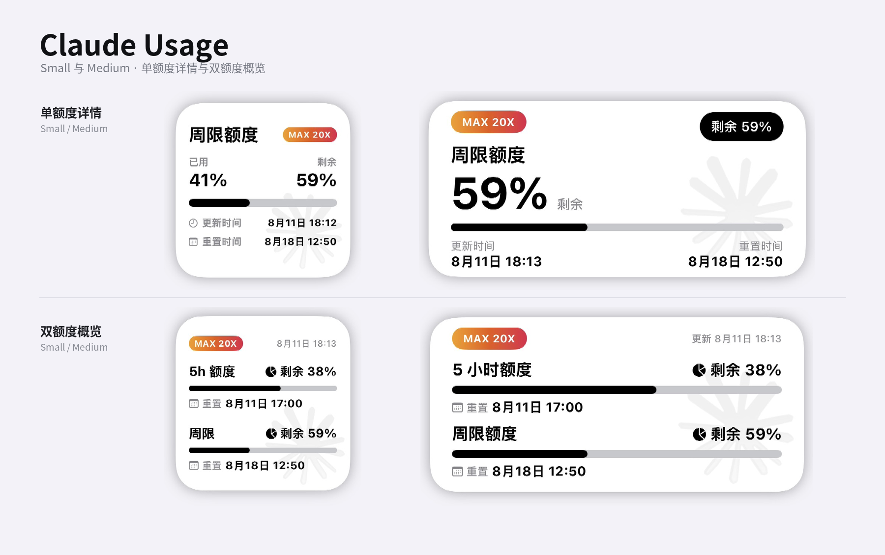

# Claude Usage



面向 [Scripting App](https://scriptingapp.github.io/) 的非官方 Claude Code 用量小组件。支持 Anthropic OAuth、多账号、5 小时/周限/Fable 周限，以及 Small、Medium 两种尺寸。

> 本项目不是 Anthropic 或 Claude 官方产品，与 Anthropic 无隶属或合作关系。

## 功能

- Anthropic Authorization Code OAuth + PKCE
- Access Token、Refresh Token 保存在本机 Keychain
- Token 到期前自动刷新
- 多账号管理，每个账号独立保存凭证、用量缓存和小组件显示设置
- 读取 5 小时、周限及 Fable 周限
- 支持“双额度概览”和“单额度详情”两种组件布局
- 支持显示已用或剩余百分比
- 展示进度条、更新时间和重置时间
- 网络失败或接口限流时回退最近一次成功缓存
- 设置页可复制脱敏诊断报告，便于 GitHub 反馈 429 / 空窗等问题
- 支持 Small、Medium 主屏幕小组件
- 支持 AppIntent 手动刷新

## 系统要求

- iPhone 或 iPad
- 已安装 Scripting App
- 具备 Claude Code 使用资格的 Claude 账号
- 个人账号通常需要 Claude Pro 或 Max；Free 账号会在 Claude Code 授权页面被拦截
- 需要联网完成 OAuth 和用量查询
- 不需要 Scripting Pro

## 安装

1. 下载项目目录或发布的 `.scripting` 安装包。
2. 将 `Claude Usage` 导入 Scripting App。
3. 在 Scripting 中运行 `Claude Usage`，进入账号和小组件设置页。
4. 按下方步骤完成 Anthropic OAuth。
5. 在主屏幕添加 Scripting 小组件，并选择 `Claude Usage`。

## OAuth 登录

Claude Usage 使用 Claude Code 当前的 Authorization Code + PKCE 登录流程：

- Authorize：`https://claude.ai/oauth/authorize`
- Token：`https://api.anthropic.com/v1/oauth/token`
- Callback：`https://platform.claude.com/oauth/code/callback`
- Scope：`org:create_api_key user:profile user:inference`

登录步骤：

1. 在设置页点击“添加 Claude 账号”或当前账号下的“授权此账号”。
2. 系统浏览器会打开 Anthropic 登录和授权页面。
3. 完成授权后，页面会显示一次性授权码，通常形如 `code#state`。
4. 复制整段授权码并返回 Claude Usage。
5. 粘贴到“Anthropic 授权码”，点击“提交授权码并完成登录”。
6. 授权成功后，脚本会刷新账号用量。

OAuth 临时状态有效期为 10 分钟。Authorization Code 通常只能交换一次；授权失败或超时后请重新开始。

> 授权码属于短期敏感凭据。不要截图、公开或发送给他人。

## 多账号与小组件参数

Claude Usage 支持同时添加多个账号：

- 每个账号拥有独立的 Keychain 凭证和用量缓存；
- 可以设置一个默认账号；
- 小组件参数为空时显示默认账号；
- 每个主屏幕小组件可以绑定不同账号；
- 组件布局、概览组合、显示额度和已用/剩余模式按账号独立保存；
- 新账号默认继承升级前的全局显示设置。

绑定账号的方法：

1. 在 Claude Usage 的“主屏幕多账号小组件”中复制目标邮箱；
2. 长按主屏幕小组件；
3. 选择“编辑小组件”；
4. 在“参数”中粘贴邮箱。

小组件参数填写目标账号邮箱即可。

## 小组件显示

### 双额度概览

同时展示两个额度窗口，可选择：

- 5 小时 + 周限（默认）
- 周限 + Fable 周限

Small 和 Medium 均显示套餐标签、已用/剩余百分比、进度条、更新时间及重置时间。

### 单额度详情

聚焦展示一个额度窗口，可选择：

- 5 小时额度
- 周限额度
- Fable 周限

Small 显示已用和剩余百分比及两项时间信息；Medium 使用大百分比突出当前额度。

如果账号没有所选额度，对应位置显示 `—`，不会替换为其他额度。无论设置为“已用”还是“剩余”，进度条始终表示已使用比例。

## 小组件设置

布局和显示选项仅应用于设置页当前选中的账号；刷新频率对所有账号生效。账号尚未创建独立设置时，会继承现有全局默认。点击“恢复当前账号默认显示设置”可删除该账号覆盖并重新继承全局默认。

### 组件布局

- 双额度概览
- 单额度详情

### 概览内容

- 5 小时 + 周限
- 周限 + Fable 周限

### 显示额度

- 5 小时额度
- 周限额度
- Fable 周限

### 用量显示

- 已用
- 剩余

### 刷新频率

- 5 分钟
- 10 分钟
- 15 分钟
- 30 分钟（默认）
- 60 分钟

iOS WidgetKit 可能根据系统调度策略延后刷新；所选时间是请求的最早刷新时间，不是严格定时器。脚本同时限制用量接口的最短实时请求间隔，以降低 HTTP 429 风险。

## 数据来源

- OAuth Authorize：`https://claude.ai/oauth/authorize`
- OAuth Token：`https://api.anthropic.com/v1/oauth/token`
- 用量：`https://api.anthropic.com/api/oauth/usage`
- OAuth Beta：`oauth-2025-04-20`

用量接口返回 5 小时、周限额度，并在账号具备相关额度时返回 Fable 周限。接口字段和访问策略可能随 Anthropic 服务端更新而变化。

这些 OAuth 和用量路径来自 Claude Code 当前实现，并非面向第三方承诺长期稳定的公共 API。Anthropic 更新后，端点、字段或访问策略可能变化。

## 问题反馈 / 诊断报告

遇到 429、空窗显示异常、授权后无法读用量时：

1. 打开 Claude Usage 设置页，选中对应账号；
2. 先点「刷新当前账号」；
3. 再点「复制诊断报告」；
4. 把报告粘贴到 GitHub Issue（报告已脱敏）。

报告会包含：

- 脚本版本、设备系统、`clientUserAgent`
- HTTP 状态 / 错误码（如 `rate_limited`）
- 是否空窗（`emptyWindows`）
- 是否仅命中缓存（`fromCacheOnly`）
- 是否持有 access/refresh token（布尔值，不含明文）
- 最近脱敏事件

报告**不会**包含：

- Access Token / Refresh Token / Authorization 头
- 完整邮箱本地部分（仅 `ab***@example.com`）
- 授权码、PKCE verifier

读报告时优先看：

- `httpStatus=429`：仍被 Anthropic 限流，核对 `clientUserAgent` 是否为 `claude-code/*`
- `emptyWindows=true` 且 `ok=true`：空窗合法快照，UI 应显示 `—`
- `fromCacheOnly=true`：3 分钟内未打 live 接口
- `hasAccessToken=false`：账号未授权或 Keychain 丢失

## 隐私与安全

- OAuth Token 仅保存在当前设备的 Scripting Keychain；
- 账号注册表、小组件设置、用量缓存和诊断探针仅保存在本机 Scripting Storage；
- 诊断报告复制前已脱敏：不含 Token / Authorization / 完整邮箱；
- 项目不通过作者服务器转发登录或用量数据；
- 项目源代码和正常导出的安装包不包含账号、邮箱、Token 或用量缓存；
- 删除账号时会同时删除该账号的本机凭证、用量缓存和独立显示设置；
- 删除账号不会自动清空全局诊断环形缓冲（键：`claude_usage_diag_events_v1` / `claude_usage_diag_last_probe_v1`，本身已脱敏、不存 Token）；
- 不要分享授权码、Token、Keychain 导出、完整 App 容器备份，或 Scripting 原始控制台全量截图；
- Claude Usage 使用独立的 `claude_*` 本地命名空间，不会读取或覆盖其他组件数据；
- 反馈时优先粘贴设置页生成的诊断报告即可；Pasteboard 写入仅本机剪贴板，不会上传；
- 若需彻底清空诊断缓冲，可在 Scripting 中清除本脚本 Storage，或卸载后重装。

## 已知限制

- Claude Code OAuth 和内部用量接口可能随时变化；
- Free 个人账号不能完成 Claude Code 订阅登录；
- Fable 独立周限并非所有套餐或账号都会返回；
- 用量接口可能返回 HTTP 429，此时组件会优先展示缓存；
- 额度窗口全部为空时按合法空快照处理，对应位置显示 `—`，不再回退旧缓存；
- 套餐字段并非所有响应都会提供，缺失时显示 `Claude`；
- WidgetKit 不保证严格按照所选分钟数刷新；
- Small 和 Medium 以外的组件尺寸未专门适配。

## 项目结构

```text
Claude Usage/
├── assets/
│   └── watermark-claude.png        透明 Claude 水印
├── components/
│   └── UsageWidgetView.tsx         Small / Medium、双额度概览 / 单额度详情布局
├── services/
│   ├── accounts.ts                 多账号注册表与 Keychain 凭证
│   ├── api.ts                      用量请求、解析、缓存与限流处理
│   ├── credentials.ts              小组件设置
│   ├── diagnostics.ts              脱敏诊断事件、探针与报告
│   ├── format.ts                   时间和百分比格式化
│   ├── oauth.ts                    Anthropic OAuth、PKCE 与 Token 刷新
│   └── types.ts                    类型定义
├── app_intents.tsx                 手动刷新意图
├── index.tsx                       账号、授权、用量与设置页
├── widget.tsx                      小组件入口
├── script.json                     Scripting 项目元数据
└── LICENSE                         MIT License
```

## 免责声明

本项目仅用于查看本人账号的 Claude Code 用量信息。请自行评估内部接口变更、账号策略和第三方脚本带来的风险，并遵守 Anthropic 服务条款。项目不保证接口永久可用，也不对用量数据延迟、解析差异、限流或服务端策略变化承担责任。
