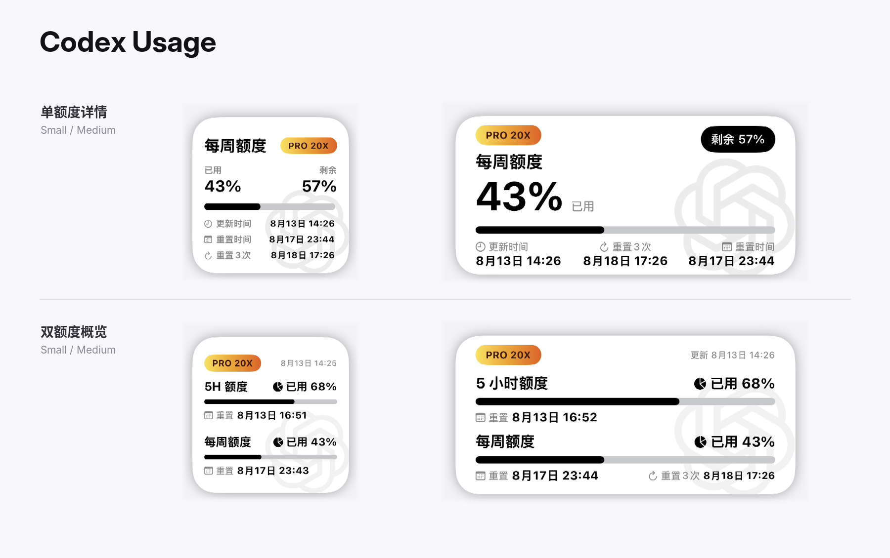

# Codex Usage

> [!WARNING]
> 本项目已停止维护，最终版本为 `1.5.1`。相关功能已整合至 [AI Usage](../AI%20Usage/)。本目录与安装包仅为兼容旧链接和历史参考保留，不再适配平台接口变化，也不再接受功能更新。



面向 [Scripting App](https://scriptingapp.github.io/) 的非官方 Codex 用量桌面小组件。支持 OpenAI OAuth、多账号、5 小时/每周/每月额度窗口，以及 Small、Medium 两种尺寸。

> 本项目不是 OpenAI 官方产品，与 OpenAI 无隶属或合作关系。

## 功能

- OpenAI Authorization Code OAuth + PKCE
- Access Token、Refresh Token 和 ID Token 保存在本机 Keychain
- Token 到期前自动刷新
- 多账号管理，每个账号独立保存凭证、用量缓存和小组件显示设置
- 读取账号返回的 5 小时、每周和每月额度窗口
- 支持单额度详情和双额度概览两种布局
- 支持显示已用或剩余百分比
- 单额度详情可选择 5 小时、每周或每月额度
- 展示额度窗口重置时间、可用重置次数及最近到期时间
- 套餐标签使用银色、金色、紫靛色等差异化样式
- 内置只读 `Mock · Pro 20x` 演示账号，用于验证双窗口、重置权益和截图效果
- 提供结构化脱敏运行日志，便于排查请求、认证和额度解析
- 网络失败时回退到本机最近一次成功缓存
- 支持 Small、Medium 主屏幕小组件
- 支持 AppIntent 手动刷新

## 系统要求

- iPhone 或 iPad
- 已安装 Scripting App
- 可正常登录并使用 Codex 的 OpenAI 账号
- 需要联网完成 OAuth 和用量查询
- 不需要 Scripting Pro

## 安装

1. 下载本项目目录或发布的 `.scripting` 安装包。
2. 将 `Codex Usage` 导入 Scripting App。
3. 在 Scripting 中运行 `Codex Usage`，进入账号和小组件设置页。
4. 按下方步骤完成 OpenAI OAuth。
5. 在主屏幕添加 Scripting 小组件，并选择 `Codex Usage`。

## OAuth 登录

1. 在设置页点击“添加 Codex 账号”或当前账号下的“授权此账号”。
2. 系统浏览器会打开 OpenAI 登录和授权页面。
3. 完成授权后，浏览器会跳转到：

   ```text
   http://localhost:1455/auth/callback?code=...&state=...
   ```

4. localhost 页面显示无法连接属于正常现象；复制 Safari 地址栏中的完整回调地址。
5. 返回 Codex Usage，将地址粘贴到“回调 URL”。
6. 点击“验证回调并完成授权”。
7. 授权成功后，脚本会读取账号邮箱并刷新用量。

OAuth 临时状态有效期为 10 分钟。Authorization Code 通常只能交换一次；授权失败或超时后请重新开始。

> 回调 URL 含短期一次性授权码。不要截图、公开或发送给他人。

## 多账号与小组件参数

Codex Usage 支持同时添加多个 OpenAI 账号：

- 每个账号拥有独立的 Keychain 凭证和用量缓存；
- 可以设置一个默认账号；
- 小组件参数为空时显示默认账号；
- 每个主屏幕小组件可以绑定不同账号；
- 组件布局、显示额度和已用/剩余模式按账号独立保存；
- 新账号默认继承升级前的全局显示设置。

绑定账号的方法：

1. 在 Codex Usage 的“主屏幕多账号小组件”中复制目标邮箱；
2. 长按主屏幕小组件；
3. 选择“编辑小组件”；
4. 在“参数”中粘贴邮箱。

小组件参数填写目标账号邮箱即可。内置 Mock 账号可直接使用参数：

```text
mock.pro20x@codex.local
```

Mock 账号不会写入真实账号注册表或 Keychain，不需要 OAuth、不访问网络，也不能设为默认账号或删除；其布局和已用/剩余设置可独立调整。

## 小组件显示

### Small

支持两种布局：

- 单额度详情：套餐徽章、所选额度、已用/剩余百分比、进度条、更新时间、额度重置时间、可用重置次数及最近到期时间；
- 双额度概览：同时显示 5 小时额度和每周额度；5 小时窗口由服务端动态提供，暂缺时显示 `—`。

### Medium

支持两种布局：

- 单额度详情：重点展示所选额度的大百分比、进度条和底部元数据；
- 双额度概览：同时显示 5 小时额度和每周额度，并在每周重置行右侧显示可用重置次数及最近到期时间。

## 小组件设置

布局和显示选项仅应用于设置页当前选中的账号；刷新频率对所有账号生效。账号尚未创建独立设置时，会继承现有全局默认。点击“恢复当前账号默认显示设置”可删除该账号覆盖并重新继承全局默认。

### 组件布局

- 单额度详情（默认）：突出显示所选额度；默认显示每周额度
- 双额度概览：固定展示 5 小时和每周两个位置；服务端暂不返回 5 小时窗口时，该位置显示 `—`

### 显示额度

仅在“单额度详情”下显示：

- 5 小时额度
- 每周额度（默认）
- 每月额度

### 用量显示

- 已用
- 剩余

### 刷新频率

- 5 分钟
- 10 分钟
- 15 分钟
- 30 分钟（默认）
- 60 分钟

iOS WidgetKit 可能根据系统调度策略延后刷新，所选时间是请求的最早刷新时间，不是严格定时器。

## 数据来源

- 内置 `Mock · Pro 20x` 只读账号，可与真实账号并列切换，用于验证重置权益、布局和展示图；不会发起 OAuth 或网络请求
- OAuth：`https://auth.openai.com`
- 用量：`https://chatgpt.com/backend-api/wham/usage`
- 重置权益：`https://chatgpt.com/backend-api/wham/rate-limit-reset-credits`
- 重置次数与到期时间：读取 `available_count` 及每项权益的 `expires_at`，组件显示最近到期时间

OAuth 使用 OpenAI 官方认证端点；用量和账户数据来自 ChatGPT 当前内部接口，并非面向第三方承诺长期稳定的公开 API。服务端更新后，路径、字段或访问策略可能变化。

## 隐私与安全

- OAuth Token 仅保存在当前设备的 Scripting Keychain；
- 账号注册表、小组件设置和用量缓存仅保存在本机 Scripting Storage；
- 项目不通过作者服务器转发登录或用量数据；
- 项目源代码和正常导出的安装包不包含你的账号、邮箱、Token 或用量缓存；
- 运行日志只记录请求状态、额度结果和脱敏错误，不输出 Token、账号标识或完整响应；
- 删除账号时会同时删除该账号的本机凭证、用量缓存和独立显示设置；
- 不要分享 OAuth 回调 URL、Token、Keychain 导出或完整 App 容器备份。

## 已知限制

- ChatGPT 内部接口可能随时变化；
- 账号实际拥有的额度窗口由服务端决定，不保证同时存在 5 小时、每周和每月窗口；
- WidgetKit 不保证严格按照所选分钟数刷新；
- Small 和 Medium 以外的组件尺寸未专门适配。

## 项目结构

```text
Codex Usage/
├── assets/                         小组件水印资源
├── components/
│   ├── UsageWidgetView.tsx         布局路由
│   ├── OverviewWidgetView.tsx      双额度概览布局
│   └── DetailWidgetView.tsx        单额度详情布局
├── services/
│   ├── accounts.ts                 多账号注册表与 Keychain 凭证
│   ├── api.ts                      用量、账户信息、缓存与窗口解析
│   ├── credentials.ts              小组件设置与固定布局基线
│   ├── format.ts                   时间、百分比和重置权益摘要格式化
│   ├── mock.ts                     内置只读 Pro 20x 演示账号与滚动数据
│   ├── oauth.ts                    OpenAI OAuth、PKCE 与 Token 刷新
│   └── types.ts                    类型定义
├── app_intents.tsx                 手动刷新意图
├── index.tsx                       账号、授权、用量与设置页
├── widget.tsx                      小组件入口
├── script.json                     Scripting 项目元数据
└── README.md
```

## 免责声明

本项目仅用于查看本人账号的用量信息。请自行评估内部接口变更、账号策略和第三方脚本带来的风险，并遵守 OpenAI 服务条款。项目不保证接口永久可用，也不对额度数据延迟、解析差异或服务端策略变化承担责任。
