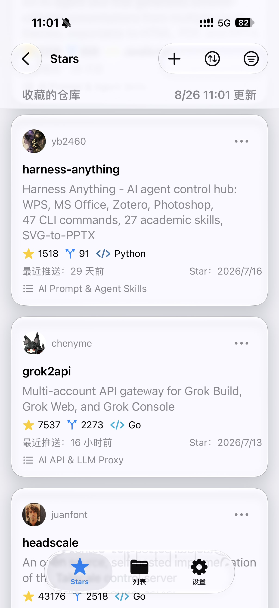
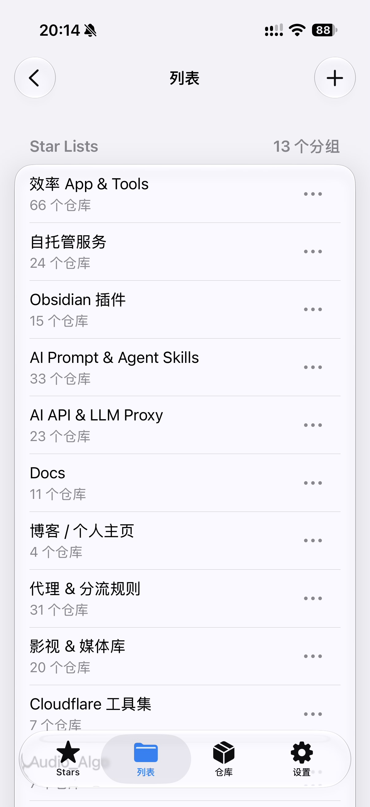
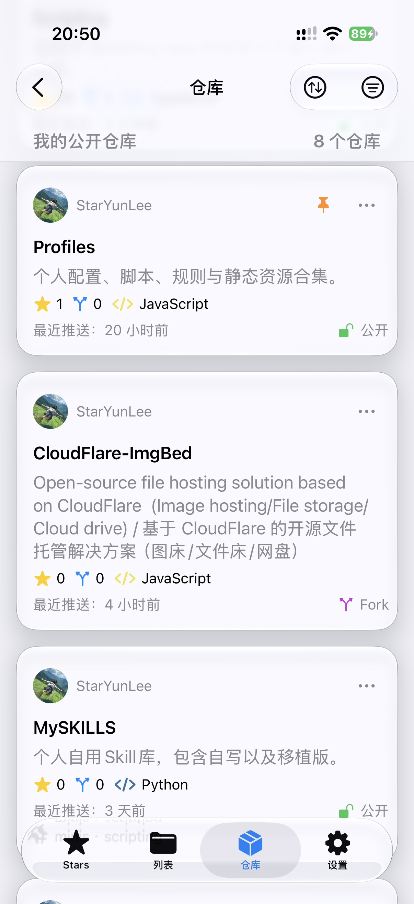
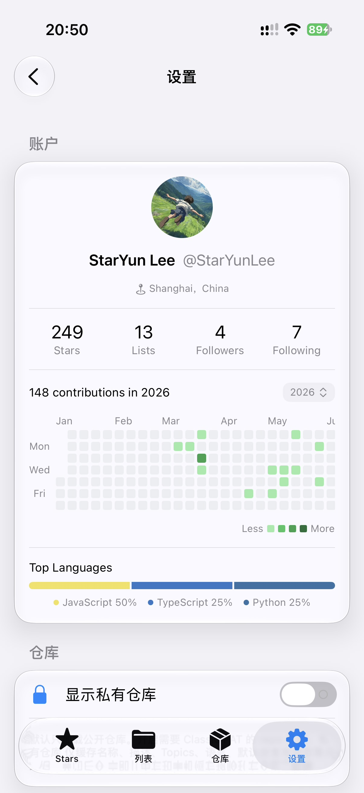

# GitHub Stars

<table>
  <tr>
    <td align="center" width="25%"></td>
    <td align="center" width="25%"></td>
    <td align="center" width="25%"></td>
    <td align="center" width="25%"></td>
  </tr>
</table>

面向 [Scripting App](https://scriptingapp.github.io/) 的非官方 GitHub Stars 与公开仓库管理应用。在 iPhone 上浏览 Stars、维护自定义列表与本人公开仓库，并查看个人资料、贡献热力图与常用语言。

当前版本：`1.0.1`

> 本项目不是 GitHub 或 Scripting App 官方产品，与上述平台无隶属或合作关系。

## 功能

- 按 Star 时间浏览全部已加星仓库，支持关键字搜索
- 独立仓库 Tab 浏览本人仓库，支持搜索、公开/私有/原创/Fork/归档筛选和多种排序；已设置为 GitHub Pinned 的仓库会优先显示
- 编辑公开仓库的描述、Homepage、Topics 与 Issues 状态；Fork 可同步上游默认分支；输入仓库名后可确认归档
- 右上角原生菜单筛选语言、自定义列表，以及按 Star 时间、最近推送、星标数或名称排序
- 粘贴 `owner/repo` 或 GitHub 仓库链接，确认后添加 Star
- 长按仓库卡片可取消 Star；确认后会同时从所有自定义列表中移除
- 创建、重命名、删除 Star Lists，并多选维护仓库归属；删除列表不会取消 Star
- 仓库卡片显示所属列表、语言色标、Star / Fork 数量与最近推送时间
- 点击仓库可在 App 内预览 GitHub 页面
- 个人资料卡展示 Stars、Lists、Followers、Following
- 多年度贡献热力图与常用语言比例条
- 本地缓存优先打开，支持离线浏览与下拉刷新

## 系统要求

- iPhone 或 iPad
- 已安装 Scripting App
- 需要 GitHub Personal access token (classic)
- 需要联网完成首次同步与写入操作
- 不需要 Scripting Pro

## 安装

1. 下载本项目目录或发布的 `GitHub-Stars.scripting` 安装包。
2. 将 `GitHub Stars` 导入 Scripting App。
3. 在 Scripting 中运行 `GitHub Stars`。
4. 打开设置页，粘贴下方说明中的 Token 并保存。

远程导入地址：

```text
https://raw.githubusercontent.com/StarYunLee/Scripting/main/GitHub-Stars.scripting
```

## Token 配置

应用使用 GitHub **Personal access token (classic)** 读取与管理 Stars、列表和个人资料。

1. 打开 GitHub **Settings → Developer settings → Personal access tokens → Tokens (classic)**。
2. 点击 **Generate new token (classic)**，勾选：
   - `user`：读取与管理个人资料、Stars 及 Lists
   - `public_repo`：管理公开仓库，并为公开仓库添加或取消 Star
   - 若需要为私有仓库添加或取消 Star，再额外勾选 `repo`
3. 生成后复制 Token，在 App **设置页** 粘贴并保存。

Fine-grained PAT 可以只读 Stars，但不能稳定管理自定义列表。完整读写请使用 classic token。

> Token 属于敏感凭据。不要截图、公开或发送给他人。展示图请避开设置页的「当前令牌」一行。

## 显示与操作

- **Stars**：默认按最近加星排列。筛选语言或列表时，分组标题显示筛选后数量与总数。
- **添加**：右上角 `+` 粘贴仓库地址，无法识别或已经加星会直接说明，确认后才会请求 GitHub。
- **取消 Star**：仅 Stars 页支持长按卡片；列表详情页不提供该操作，避免误当成移出当前分组。
- **列表**：删除自定义列表只去掉分组，不会取消仓库 Star。
- **仓库**：默认只显示本人公开仓库；设置页可开启私有仓库，需 Classic PAT 的 `repo` 权限。已设置为 GitHub Pinned 的仓库会按 GitHub 顺序置顶显示，并标注 Pinned。可编辑描述、Homepage、Topics 和 Issues；Fork 可同步上游默认分支，冲突时不会强制覆盖；归档前必须输入仓库名称确认。

## 数据来源

数据来自 GitHub REST 与 GraphQL API，用于读取已登录账号的 Stars、Lists、个人资料、贡献日历，以及仓库 Tab 置顶所需的 Pinned 仓库，并在确认后写入 Star 与列表变更。

GitHub 更新接口、权限策略或列表功能后，部分能力可能变化。

## 隐私与安全

- Token 仅保存在当前脚本独立的 iOS Keychain，不进入 Storage、源码、日志或错误文本
- Stars、列表、个人资料等缓存仅保存在本机 Scripting Storage，且不含 Token
- 项目不通过作者服务器转发登录或 GitHub 数据
- 源代码和正常导出的安装包不包含你的 Token、账号缓存或 Keychain 数据
- 清除已保存的令牌时，会同时清理本机缓存
- 不要分享 Token、Keychain 导出或完整 App 容器备份

## 已知限制

- 仓库 Tab 默认只显示公开仓库；显示私有仓库需在设置页开启，并使用带 `repo` 权限的 Classic PAT
- 私有仓库只缓存本机元数据；关闭开关会立即从内存和 Storage 清除这些元数据
- 缺少 `public_repo` 时，添加或取消公开仓库 Star 可能失败
- 不做全站仓库搜索，也不监听剪贴板自动加星
- GitHub Pinned 只能在 GitHub 网页管理，仓库 Tab 仅读取并置顶显示已设置的 Pinned 仓库
- 贡献热力图按 GitHub 返回的日历渲染，历史年份需手动切换

## 项目结构

```text
GitHub Stars/
├── assets/                   应用展示图
├── auth/                     Token 读写与掩码
├── pages/                    Stars、列表、仓库、设置与更新日志
├── services/                 GitHub API、缓存与状态
├── ui/                       卡片、热力图与 Liquid Glass 组件
├── data/                     GitHub Linguist 语言颜色
├── index.tsx                 应用入口
├── changelog.ts              版本更新日志
├── script.json               Scripting 项目元数据
├── LICENSE                   MIT License
└── README.md
```

## 免责声明

本项目仅用于管理本人 GitHub 账号的 Stars、自定义列表和本人仓库。请自行评估第三方脚本、Token 权限和接口变更带来的风险，并遵守 GitHub 与 Scripting App 的服务条款。项目不保证接口永久可用，也不对数据延迟、权限失败、限流或服务端策略变化承担责任。
