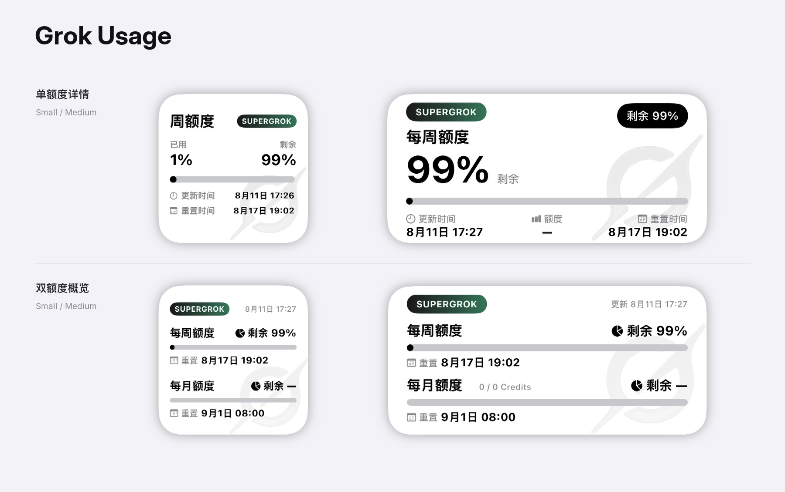

# Grok Usage

> [!WARNING]
> 本项目已停止维护，最终版本为 `1.5.1`。相关功能已整合至 [AI Usage](../AI%20Usage/)。本目录与安装包仅为兼容旧链接和历史参考保留，不再适配平台接口变化，也不再接受功能更新。



面向 [Scripting App](https://scriptingapp.github.io/) 的非官方 Grok 订阅用量小组件。支持 xAI OAuth、多账号、统一每周额度、用量限额重置权益，以及 Small、Medium 两种尺寸。

> 本项目不是 xAI 或 Grok 官方产品，与 xAI 无隶属或合作关系。

## 功能

- xAI Authorization Code OAuth + PKCE
- Access Token、Refresh Token 和 ID Token 保存在本机 Keychain
- Token 到期前自动刷新
- 多账号管理，每个账号独立保存凭证、额度缓存和已用/剩余显示设置
- 读取统一每周额度、周重置时间和用量限额重置权益
- 支持显示已用或剩余百分比，右上角同步显示互补数据
- 展示额度进度条、重置时间、可重置次数及最近到期时间
- Small 与 Medium 固定展示每周额度
- SuperGrok / SuperGrok Heavy 套餐徽章
- 网络失败时回退到本机最近一次成功缓存
- 支持 AppIntent 手动刷新

## 系统要求

- iPhone 或 iPad
- 已安装 Scripting App
- 可使用 Grok Build 订阅额度的 xAI / SuperGrok 账号
- 需要联网完成 OAuth 和额度查询
- 不需要 Scripting Pro

## 安装

1. 下载本项目目录或发布的 `.scripting` 安装包。
2. 将 `Grok Usage` 导入 Scripting App。
3. 在 Scripting 中运行 `Grok Usage`，进入账号和小组件设置页。
4. 按下方步骤完成 xAI OAuth。
5. 在主屏幕添加 Scripting 小组件，并选择 `Grok Usage`。

## OAuth 登录

Grok Usage 使用 xAI 公共 OAuth Client 的 Authorization Code + PKCE：

- Authorize：`https://auth.x.ai/oauth2/authorize`
- Token：`https://auth.x.ai/oauth2/token`
- 固定回调：`http://127.0.0.1:56122/callback`
- Scope：`openid profile email offline_access grok-cli:access api:access`

登录步骤：

1. 在设置页点击“添加 Grok 账号”或当前账号下的“授权此账号”。
2. 系统浏览器会打开 xAI 登录和授权页面。
3. 完成授权后，浏览器会跳转到：

   ```text
   http://127.0.0.1:56122/callback?code=...&state=...
   ```

4. 页面显示无法连接属于正常现象；复制 Safari 地址栏中的完整回调地址。
5. 返回 Grok Usage，将地址粘贴到“回调地址或授权码”。
6. 如果 xAI 页面直接显示一次性 Authorization Code，也可以只粘贴该代码。
7. 点击“提交回调并完成授权”。
8. 授权成功后，脚本会读取账号身份并刷新 Grok Build 额度。

OAuth 临时状态有效期为 10 分钟。Authorization Code 通常只能交换一次；授权失败或超时后请重新开始。

> 回调 URL 和一次性代码都属于短期敏感凭据。不要截图、公开或发送给他人。

## 多账号与小组件参数

Grok Usage 支持同时添加多个账号：

- 每个账号拥有独立的 Keychain 凭证和额度缓存；
- 可以设置一个默认账号；
- 小组件参数为空时显示默认账号；
- 每个主屏幕小组件可以绑定不同账号；
- 已用/剩余模式按账号独立保存；
- 旧版布局和额度窗口设置会被安全忽略，小组件统一显示每周额度；
- 新账号默认继承升级前的全局已用/剩余设置。

绑定账号的方法：

1. 在 Grok Usage 的“主屏幕多账号小组件”中复制目标邮箱；
2. 长按主屏幕小组件；
3. 选择“编辑小组件”；
4. 在“参数”中粘贴邮箱。

小组件参数填写目标账号邮箱即可。

## 额度与显示逻辑

Grok 当前对付费用户采用统一每周用量池。组件从 Credits Billing 数据读取：

- 已用百分比；
- 剩余百分比；
- 每周周期结束/重置时间；
- Grok Build 产品消耗；
- 用量限额重置权益数量与每项到期时间。

旧版 `/v1/billing` 月度字段仍仅用于套餐标签兼容，不再作为 Widget 内容。

### Small

- 显示周额度的已用与剩余百分比、进度条、更新时间、周重置时间；
- 第三行显示可重置次数和最近一项有效权益的到期时间。

### Medium

- 中心显示已用或剩余百分比，右上角显示互补数据；
- 底部三列显示更新时间、可重置次数及最近到期时间、周重置时间。

无论“用量显示”选择已用还是剩余，进度条始终表示已使用比例。

## 小组件设置

已用/剩余显示仅应用于设置页当前选中的账号；刷新频率对所有账号生效。旧版 `overview / monthly / auto` 设置继续兼容读取但不会影响渲染，所有账号会无感迁移为每周额度。点击“恢复当前账号默认显示设置”可删除该账号覆盖并重新继承全局默认。

### 用量显示

- 已用
- 剩余

### 刷新频率

- 5 分钟
- 10 分钟
- 15 分钟
- 30 分钟（默认）
- 60 分钟

iOS WidgetKit 可能根据系统调度策略延后刷新，所选时间是请求的最早刷新时间，不是严格定时器。

## 数据来源

- OAuth Discovery：`https://auth.x.ai/.well-known/openid-configuration`
- OAuth Authorize：`https://auth.x.ai/oauth2/authorize`
- OAuth Token：`https://auth.x.ai/oauth2/token`
- 月度兼容数据：`https://cli-chat-proxy.grok.com/v1/billing`
- 统一每周额度：`https://cli-chat-proxy.grok.com/v1/billing?format=credits`
- 重置权益：`https://grok.com/prod_mc_billing.ConsumerUiSvc/GetRemainingResets`
- CLI 请求标识：`x-xai-token-auth: xai-grok-cli`
- CLI 用户标识：OAuth 用户 `sub`（通过 `x-userid` 发送）
- CLI 客户端标识：`x-grok-client-version`

OAuth 使用 xAI 认证端点；Billing 数据来自 Grok Build / CLI 当前使用的订阅额度接口，并非面向第三方承诺长期稳定的公开 API。xAI 更新后，路径、字段或访问策略可能变化。

## 套餐标签

Grok Billing 响应并不总是提供统一、稳定的套餐名称。组件优先展示已识别的 SuperGrok / SuperGrok Heavy 标签；月度额度仅作为缺少明确套餐信息时的兜底判断。

套餐标签仅用于界面展示，不应视为 xAI 官方账户套餐判定。Small 小组件为避免截断，会将 `SUPERGROK HEAVY` 简写为 `HEAVY`；Medium 保留完整名称。

## 隐私与安全

- OAuth Token 仅保存在当前设备的 Scripting Keychain；
- 账号注册表、小组件设置和额度缓存仅保存在本机 Scripting Storage；
- 项目不通过作者服务器转发登录或额度数据；
- 项目源代码和正常导出的安装包不包含你的账号、邮箱、Token 或额度缓存；
- 删除账号时会同时删除该账号的本机凭证、额度缓存和独立显示设置；
- 不要分享 OAuth 回调 URL、一次性代码、Token、Keychain 导出或完整 App 容器备份；
- Grok Usage 使用独立的 `grok_*` 本地命名空间，不会读取或覆盖 Codex Usage 数据。

## 已知限制

- Grok 统一每周额度、旧月度兼容字段和重置权益接口可能随时变化；
- OAuth 成功不代表所有账号都具有 Grok 订阅用量访问权限；
- 运行日志只记录请求状态、额度结果和脱敏错误，不输出 Token、用户标识或完整响应；
- 套餐名称属于推断结果；
- WidgetKit 不保证严格按照所选分钟数刷新；
- Small 和 Medium 以外的组件尺寸未专门适配。

## 项目结构

```text
Grok Usage/
├── assets/                         Grok 水印资源
├── components/
│   ├── UsageWidgetView.tsx         每周额度入口
│   └── WeeklyUsageWidgetView.tsx   Small / Medium 每周额度布局
├── services/
│   ├── accounts.ts                 多账号注册表与 Keychain 凭证
│   ├── api.ts                      Grok Billing、额度解析与缓存
│   ├── credentials.ts              小组件显示设置
│   ├── format.ts                   时间和百分比格式化
│   ├── oauth.ts                    xAI OAuth、PKCE 与 Token 刷新
│   └── types.ts                    类型定义
├── app_intents.tsx                 手动刷新意图
├── index.tsx                       账号、授权、额度与设置页
├── widget.tsx                      小组件入口
├── script.json                     Scripting 项目元数据
└── README.md
```

## 免责声明

本项目仅用于查看本人账号的 Grok Build 订阅额度。请自行评估内部接口变更、账号策略和第三方脚本带来的风险，并遵守 xAI 服务条款。项目不保证接口永久可用，也不对额度数据延迟、套餐推断差异或服务端策略变化承担责任。
