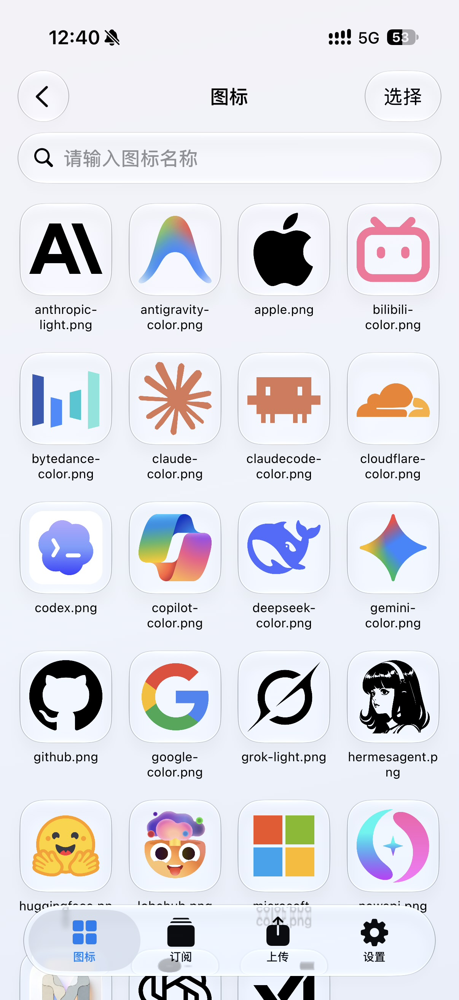
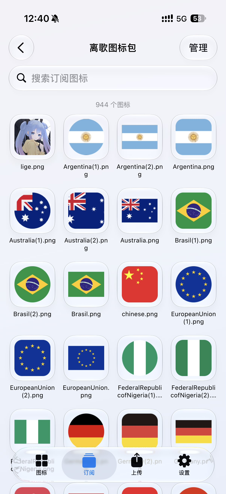
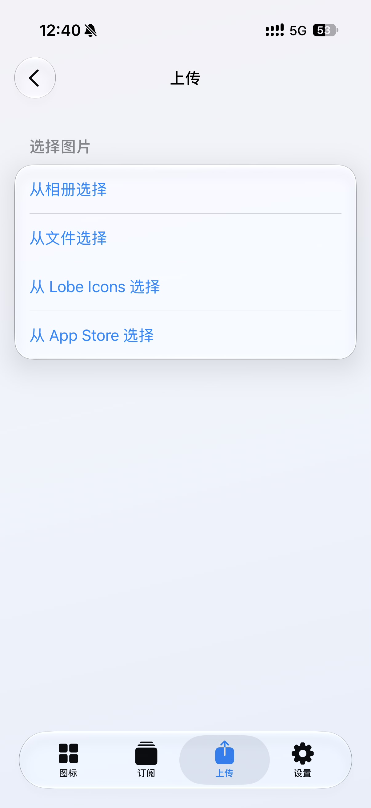
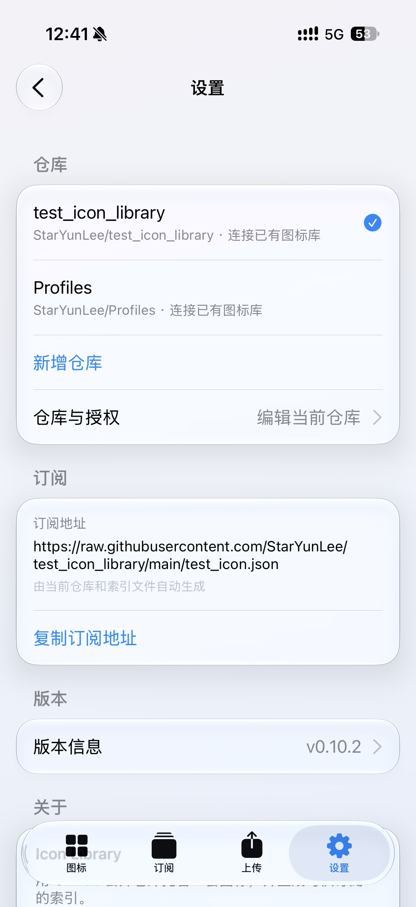

# Icon Library

<table>
  <tr>
    <td align="center" width="25%"></td>
    <td align="center" width="25%"></td>
    <td align="center" width="25%"></td>
    <td align="center" width="25%"></td>
  </tr>
</table>

面向 [Scripting App](https://scriptingapp.github.io/) 的非官方图标库管理应用。用 GitHub 公开仓库托管自建图标，并自动生成可供订阅的索引；也可只读浏览别人的公开图标索引。

当前版本：`1.0.0`

> 本项目不是 GitHub、Apple、LobeHub 或 Scripting App 官方产品，与上述平台无隶属或合作关系。

## 功能

- 管理多个 GitHub 公开图标库，按仓库独立保存访问令牌与显示名称
- 浏览当前仓库图标，支持搜索、重命名和批量删除
- 从相册、文件、Lobe 品牌图标和 App Store 应用图标导入
- App Store 图标支持多尺寸，以及官方圆角或原图
- 上传或批量删除合并为单次提交，同名文件可选择覆盖或跳过
- 订阅别人的公开 `icons.json`，只读浏览、复制引用或导出 PNG
- 图标、订阅、Lobe 与 App Store 详情页可将当前图片导出为 PNG
- 可一键创建新图标库或连接已有目录，并按需写入 GitHub Actions 索引工作流
- 界面采用自适应毛玻璃卡片，跟随系统浅色 / 深色模式

## 系统要求

- iPhone 或 iPad
- 已安装 Scripting App
- 需要 GitHub Personal access token
- 需要联网完成仓库读写、订阅加载与图标导入
- 图标预览与订阅依赖公开 raw 链接，暂不支持私有仓库
- 不需要 Scripting Pro

## 安装

1. 下载本项目目录或发布的 `Icon-Library.scripting` 安装包。
2. 将 `Icon Library` 导入 Scripting App。
3. 在 Scripting 中运行 `Icon Library`。
4. 打开设置页，保存公开仓库和个人访问令牌。

远程导入地址：

```text
https://raw.githubusercontent.com/StarYunLee/Scripting/main/Icon-Library.scripting
```

## 授权与配置

应用需要 GitHub **Personal access token (Fine-grained 或 Classic)** 管理公开仓库：

1. 准备一个 **GitHub Public** 仓库。
2. 在 GitHub 生成访问令牌：
   - **Fine-grained PAT**（推荐）：Repository 选择你的图标仓库，权限勾选 `Contents: Read and write`
   - **Classic PAT**：勾选 `public_repo`
3. 在 App **设置 → 仓库与授权** 粘贴并保存令牌。
4. 选择 **创建图标库** 或 **连接已有图标库**。

> Token 属于敏感凭据。不要截图、公开或发送给他人。

## 两种模式

- **创建图标库**：指定图标存储目录与 JSON 文件名。App 会写入 GitHub Actions 工作流，每次 push 自动更新索引。
- **连接已有图标库**：指定已有目录与 JSON 路径。App 只按现有结构上传或删除图标，不改写工作流。

## 显示与操作

- **图标**：浏览当前仓库中的图标，支持搜索、选择、重命名、删除和导出 PNG。
- **订阅**：添加别人的公开 `icons.json`，只读浏览、复制引用或导出 PNG，不写入对方仓库。
- **上传**：从相册、文件、Lobe Icons 或 App Store 加入草稿，确认后提交到当前仓库。
- **设置**：切换仓库、编辑当前仓库授权，以及复制当前库的订阅地址。

## 数据来源

- 自有图标库的读写使用 GitHub REST API 与 Git Data API
- 订阅索引来自公开的 `icons.json`
- Lobe 图标来自公开 CDN 上的 Lobe Icons 资源
- App Store 图标来自 iTunes Search / 公开 artwork 链接

相关接口、权限策略或资源地址变化后，部分能力可能受影响。

## 隐私与安全

- Token 仅保存在当前脚本独立的 iOS Keychain，不进入 Storage、源码、日志或错误文本
- 仓库配置、订阅列表和本地缓存仅保存在本机 Scripting Storage，且不含 Token
- 项目不通过作者服务器转发登录或 GitHub 数据
- 源代码和正常导出的安装包不包含你的 Token、账号缓存或 Keychain 数据
- 不要分享 Token、Keychain 导出或完整 App 容器备份

## 已知限制

- 仅支持 GitHub 公开仓库；私有仓库无法免鉴权展示图片或提供订阅
- 单张图标建议控制在 1MB 以内，以保证移动端列表滚动与解码流畅
- 订阅是只读浏览，不会改写对方仓库
- App Store 官方圆角与原图分别使用对应 artwork，不会互相回退
- Lobe 图标依赖公开 CDN，网络或源站变化时可能加载失败

## 项目结构

```text
Icon Library/
├── assets/                   应用展示图
├── components/               共享毛玻璃卡片与自适应背景
├── pages/                    图标列表、只读订阅、上传草稿、Lobe/App Store 选择与设置
├── resources/                按需加载的 Lobe Icons 元数据
├── services/                 GitHub API、多文件提交、多仓库调度、缓存与导入
├── index.tsx                 应用入口与 TabView
├── changelog.ts              版本更新日志
├── script.json               Scripting 项目元数据
├── LICENSE                   MIT License
└── README.md
```

## 免责声明

本项目仅用于管理本人的 GitHub 公开图标库，以及浏览公开图标索引。请自行评估第三方脚本、Token 权限、图标版权和接口变更带来的风险，并遵守 GitHub、Apple、LobeHub 与 Scripting App 的服务条款。项目不保证接口永久可用，也不对数据延迟、权限失败、限流或服务端策略变化承担责任。
