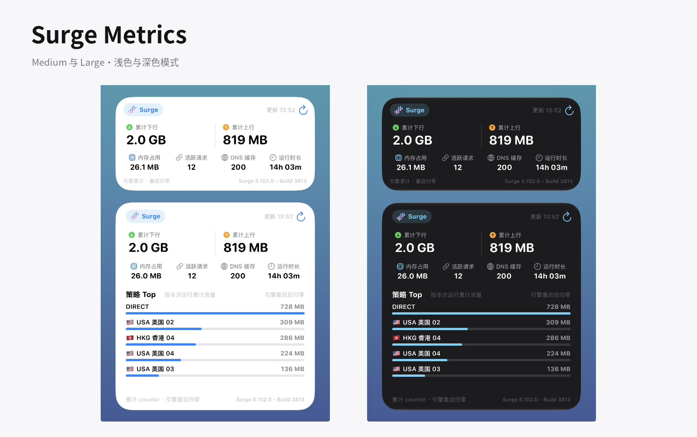

# Surge Metrics



面向 [Scripting App](https://scriptingapp.github.io/) 的非官方 Surge iOS 运行指标小组件。通过 Surge HTTP API 的 Prometheus Metrics 端点读取本次引擎运行的累计流量和核心状态，支持 Medium、Large 两种尺寸及浅色、深色模式。

> 本项目不是 Surge 官方产品，与 Surge Networks Inc. 无隶属或合作关系。

## 功能

- 读取 Surge 官方 `GET /v1/metrics` Prometheus Metrics 端点
- 展示本次引擎运行的累计下行和累计上行，重启后归零
- 展示内存占用、活跃请求、DNS 缓存、运行时长
- `active_bans > 0` 时在 Medium 底部显示未授权访问封禁告警
- Medium：聚焦累计流量和核心运行状态，不展示策略统计
- Large：在核心总览下展示策略累计流量 Top 1–5
- 策略列表可隐藏 `DIRECT`、`REJECT` 等内置策略
- 支持 1 / 5 / 10 / 15 / 30 / 60 分钟自动刷新请求
- Medium / Large 右上角显示 metrics 实际更新时间（如“更新 13:41”），并紧贴 AppIntent 手动刷新按钮
- 设置页使用绝对时间显示上次数据刷新，便于精确核对
- 设置页提供 HTTP API 配置、连通测试、缓存清理及双尺寸预览
- 使用透明背景渐变图标，适配浅色和深色模式

## 系统要求

- iPhone 或 iPad
- 已安装 Scripting App
- Surge iOS **5.22.0+**（提供 `/v1/metrics`）
- Surge 已启动，且配置中开启 HTTP API
- 不需要 Scripting Pro

## 安装

1. 下载本项目目录或发布的 `Surge-Metrics.scripting` 安装包。
2. 使用 Scripting App 打开并导入 `Surge Metrics`。
3. 按下方说明配置 Surge HTTP API。
4. 在 Scripting 中运行 `Surge Metrics`，填写 Host、Port 和 API Key。
5. 点击“测试连通”，再点击“立即刷新并预览”。
6. 在主屏幕添加 Scripting 小组件，选择 `Surge Metrics`，按需使用 Medium 或 Large 尺寸。

## Surge 配置

在 Surge 配置的 `[General]` 中增加：

```ini
http-api = YOUR_SECRET_KEY@127.0.0.1:6171
```

- `YOUR_SECRET_KEY` 请替换为足够长的随机字符串；
- 小组件默认 Host 为 `127.0.0.1`，Port 为 `6171`；
- 保存配置后保持 Surge VPN 开关打开。

如果 Scripting 无法访问 `127.0.0.1`，可在受信任的局域网中改为：

```ini
http-api = YOUR_SECRET_KEY@0.0.0.0:6171
```

然后将小组件 Host 改为 iPhone 当前局域网 IP。`0.0.0.0` 会向局域网开放 HTTP API，请务必使用强 Key，公共 Wi-Fi 下不建议使用。

可选 HTTPS：

```ini
http-api-tls = true
```

启用 HTTPS 需要已配置 Surge MITM CA，并让客户端信任相应证书。

## 小组件显示

### Medium

- 累计下行、累计上行
- 内存占用、活跃请求、DNS 缓存、运行时长
- 引擎累计口径与 Surge 版本 / Build
- 未授权访问封禁条件告警

### Large

- Medium 的全部核心数据
- 策略累计流量 Top 1–5
- 策略相对进度条
- 本次引擎运行累计口径与版本信息

## 小组件设置

### 自动刷新间隔

- 1 分钟
- 5 分钟（默认）
- 10 分钟
- 15 分钟
- 30 分钟
- 60 分钟

WidgetKit 可能根据系统调度策略延后刷新；所选时间是请求下一次时间线的最早时间，不是严格定时器。需要立即更新时，可点击小组件右上角的刷新按钮。

### Large 策略数量

- Top 1
- Top 2
- Top 3
- Top 4
- Top 5（默认）

### 其他设置

- 隐藏 `DIRECT` / `REJECT` 等内置策略
- 使用 HTTPS (`http-api-tls`)
- Medium / Large 设置页预览

## 数据来源与口径

组件使用 Surge 官方 HTTP API：

```text
GET /v1/metrics
```

主要指标：

- `surge_build_info`：版本和 Build
- `surge_uptime_seconds`：引擎运行时长
- `surge_memory_bytes`：引擎物理内存占用
- `surge_active_requests`：活跃请求数
- `surge_dns_cache_entries`：DNS 缓存条目数
- `surge_active_bans`：未授权访问封禁数
- `surge_interface_in_bytes_total` / `surge_interface_out_bytes_total`：接口累计流量
- `surge_policy_in_bytes_total` / `surge_policy_out_bytes_total`：策略累计流量

流量 counter 从 Surge 引擎本次启动开始累计，重启后归零。多个 interface 会分别返回，组件将同方向 counter 汇总；如果不同接口的统计范围重叠，汇总值可能重复计算，因此适合观察本次运行流量规模，不应视为运营商账单。

组件不根据 Widget 刷新间隔推导或展示所谓“实时速率”，避免 iOS 调度延迟造成误导。

## 隐私与安全

- Host、Port、API Key、小组件设置和指标缓存仅保存在当前设备的 Scripting Storage；
- 项目不通过作者服务器转发 HTTP API 请求或指标数据；
- 项目源码和正常导出的安装包不包含作者的 API Key、运行时指标或本机缓存；
- 日志不输出 API Key、完整鉴权 URL 或完整指标响应；
- 不要分享 API Key、Scripting Storage 导出或完整 App 容器备份；
- `Surge Metrics` 使用独立的 `surge_metrics_*` 本地命名空间，不会读取或覆盖其他组件数据。

## 已知限制

- 仅支持 Surge iOS 5.22.0+；
- WidgetKit 不保证严格按照所选分钟数刷新；
- 手动刷新会立即请求指标，但画面重载仍由 WidgetKit 执行；
- 多接口 counter 汇总可能存在统计范围重叠；
- Metrics 端点不提供 CPU 占用、节点延迟、规则命中、DNS 命中率或历史趋势；
- 仅对 Medium 和 Large 尺寸进行专门适配。

## 项目结构

```text
Surge Metrics/
├── assets/
│   ├── surge-metrics-icon.png       透明渐变图标
│   └── surge-metrics-preview.png    Medium / Large 明暗模式预览
├── components/
│   ├── MediumWidgetView.tsx         Medium 核心总览
│   ├── LargeWidgetView.tsx          Large 策略展开
│   └── WidgetPrimitives.tsx         共用视觉组件
├── services/
│   ├── format.ts                    流量、时间和版本格式化
│   ├── metrics.ts                   Metrics 请求、解析、聚合与缓存
│   ├── settings.ts                  连接和小组件设置
│   └── types.ts                     类型定义
├── app_intents.tsx                  手动刷新意图
├── index.tsx                        连接、操作、设置与双尺寸预览
├── widget.tsx                       Medium / Large 小组件入口
├── script.json                      Scripting 项目元数据
├── README.md                        使用说明
└── LICENSE                          MIT License
```

## 免责声明

本项目仅用于查看本人设备上的 Surge 运行指标。请自行评估 HTTP API 开放范围、局域网访问和第三方脚本带来的风险，并遵守 Surge 软件许可及相关服务条款。项目不保证指标端点永久保持兼容，也不对数据延迟、统计口径差异、WidgetKit 调度或错误配置造成的风险承担责任。
